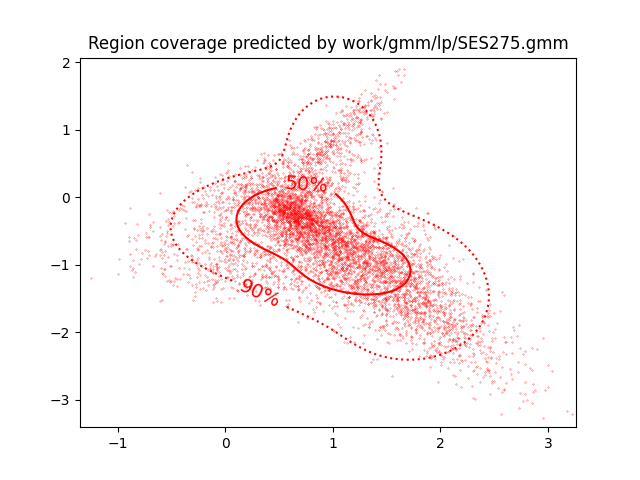
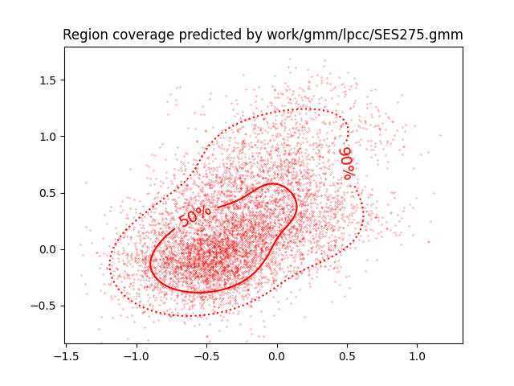
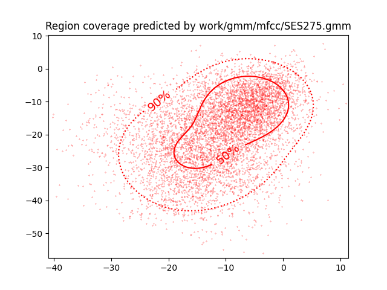

PAV - P4: reconocimiento y verificación del locutor
===================================================

Obtenga su copia del repositorio de la práctica accediendo a [Práctica 4](https://github.com/albino-pav/P4)
y pulsando sobre el botón `Fork` situado en la esquina superior derecha. A continuación, siga las
instrucciones de la [Práctica 2](https://github.com/albino-pav/P2) para crear una rama con el apellido de
los integrantes del grupo de prácticas, dar de alta al resto de integrantes como colaboradores del proyecto
y crear la copias locales del repositorio.

También debe descomprimir, en el directorio `PAV/P4`, el fichero [db_8mu.tgz](https://atenea.upc.edu/mod/resource/view.php?id=3508877?forcedownload=1)
con la base de datos oral que se utilizará en la parte experimental de la práctica.

Como entrega deberá realizar un *pull request* con el contenido de su copia del repositorio. Recuerde
que los ficheros entregados deberán estar en condiciones de ser ejecutados con sólo ejecutar:

~~~~~~~~~~~~~~~~~~~~~~~~~~~~~~~~~~~~~~~~~~~~~~~~~~~~~.sh
  make release
  run_spkid mfcc train test classerr verify verifyerr
~~~~~~~~~~~~~~~~~~~~~~~~~~~~~~~~~~~~~~~~~~~~~~~~~~~~~

Recuerde que, además de los trabajos indicados en esta parte básica, también deberá realizar un proyecto
de ampliación, del cual deberá subir una memoria explicativa a Atenea y los ficheros correspondientes al
repositorio de la práctica.

A modo de memoria de la parte básica, complete, en este mismo documento y usando el formato *markdown*, los
ejercicios indicados.

## Ejercicios.

### SPTK, Sox y los scripts de extracción de características.

- Analice el script `wav2lp.sh` y explique la misión de los distintos comandos involucrados en el *pipeline*
  principal (`sox`, `$X2X`, `$FRAME`, `$WINDOW` y `$LPC`). Explique el significado de cada una de las 
  opciones empleadas y de sus valores.

  - **Sox**: Sox es un comando multiplataforma para trabajar con archivos de audio. Permite reproducir, grabar, leer y escribir en archivos de audio con distintos formatos. Va muy bien para trabajar con archivos de audio. Nosotros lo usamos par obtener coeficientes del audio de entrada.

  - **$X2X**: En esta variable se guarda el comando _sptk x2x_ para Ubuntu, que és el que usamos los dos componentes de la pareja. El comando X2X se utilitza para convertir formatos de datos. Pasa de un formato x a un formato x, x to x. Nosotros lo usamos pasando de signed int a short (16bits). Luego en el recuento de filas también lo usamos para pasar a float.

  - **$FRAME**: El comando _sptk frame_ se usa a continuación del _sptk x2x_. Este comando segmenta la secuencia i la divide en tramas. En nuestro caso són tramas de 240 muestras cada 80 muestras (superposición).

  - **$WINDOW**: El comando _sptk window_, como el nombre indica, se usa para enventanar tramas de datos. Nosotros usamos la ventana Blackman con las ventanas de 240 muestras.

  - **$LPC**: El comando _sptk lpc_ calcula los coeficientes LPC. En nuestro caso, el orden sale lo escojemos al llamar a _wav2lp.sh_.

- Explique el procedimiento seguido para obtener un fichero de formato *fmatrix* a partir de los ficheros de
  salida de SPTK (líneas 45 a 48 del script `wav2lp.sh`).

  Estas líneas de codigo son las encargadas de calcular cuantas columnas y cuantas filas tendra la matriz:
  ~~~~~~~~~~~~~~~~~~~~~~~~~~~~~~~~~~~~~~~~~~~~~~~~~~~~~.sh
  ncol=$((lpc_order+1)) # lpc p =>  (gain a1 a2 ... ap) 
  nrow=$($X2X +fa < $base.lp | wc -l | perl -ne 'print $_/'$ncol', "\n";')
  ~~~~~~~~~~~~~~~~~~~~~~~~~~~~~~~~~~~~~~~~~~~~~~~~~~~~~

  Sabemos que tendremos tantas columnas como coeficientes LPC más 1 (el primero es ganancia). 
  El número de columnas es un poco más complejo de obtener, convierte el archivo creado anteriormente a ascii i cuenta las líneass (filas).
  Entonces cada fila corresponde a cada trama de la señal y las columnas a los coeficientes.

  * ¿Por qué es conveniente usar este formato (u otro parecido)? Tenga en cuenta cuál es el formato de
    entrada y cuál es el de resultado.

    Guardar los datos en forma de matriz nos permite ver claramente los coeficientes de cada trama. Estan los datos bien estructurados y si trabajas bien con ellos es muy útil.

- Escriba el *pipeline* principal usado para calcular los coeficientes cepstrales de predicción lineal
  (LPCC) en su fichero <code>scripts/wav2lpcc.sh</code>:

  ~~~~~~~~~~~~~~~~~~~~~~~~~~~~~~~~~~~~~~~~~~~~~~~~~~~~~.sh
  sox $inputfile -t raw -e signed -b 16 - | $X2X +sf | $FRAME -l 240 -p 80 | $WINDOW -l 240 -L 240 |
	$LPC -l 240 -m $lpc_order | $LPCC -m $lpc_order -M $lpcc_order > $base.lpcc
  ~~~~~~~~~~~~~~~~~~~~~~~~~~~~~~~~~~~~~~~~~~~~~~~~~~~~~

- Escriba el *pipeline* principal usado para calcular los coeficientes cepstrales en escala Mel (MFCC) en su
  fichero <code>scripts/wav2mfcc.sh</code>:

  ~~~~~~~~~~~~~~~~~~~~~~~~~~~~~~~~~~~~~~~~~~~~~~~~~~~~~.sh
  sox $inputfile -t raw -e signed -b 16 - | $X2X +sf | $FRAME -l 240 -p 80 | $WINDOW -l 240 -L 240 |
	$MFCC -l 240 -s 8 -w 1 -m $mfcc_order -n $mfcc_nfilter > $base.mfcc
  ~~~~~~~~~~~~~~~~~~~~~~~~~~~~~~~~~~~~~~~~~~~~~~~~~~~~~

### Extracción de características.

- Inserte una imagen mostrando la dependencia entre los coeficientes 2 y 3 de las tres parametrizaciones
  para todas las señales de un locutor.
  
  + Indique **todas** las órdenes necesarias para obtener las gráficas a partir de las señales 
    parametrizadas.

  
  ~~~~~~~~~~~~~~~~~~~~~~~~~~~~~~~~~~~~~~~~~~~~~~~~~~~~~.sh
  plot_gmm_feat -x2 -y3 work/gmm/lp/SES275.gmm work/lp/BLOCK27/SES275/SA275S*
  ~~~~~~~~~~~~~~~~~~~~~~~~~~~~~~~~~~~~~~~~~~~~~~~~~~~~~

  
  ~~~~~~~~~~~~~~~~~~~~~~~~~~~~~~~~~~~~~~~~~~~~~~~~~~~~~.sh
  plot_gmm_feat -x2 -y3 work/gmm/lpcc/SES275.gmm work/lpcc/BLOCK27/SES275/SA275S*
  ~~~~~~~~~~~~~~~~~~~~~~~~~~~~~~~~~~~~~~~~~~~~~~~~~~~~~

  
  ~~~~~~~~~~~~~~~~~~~~~~~~~~~~~~~~~~~~~~~~~~~~~~~~~~~~~.sh
  plot_gmm_feat -x 2 -y 3 work/gmm/mfcc/SES275.gmm work/mfcc/BLOCK27/SES275/SA275S*
  ~~~~~~~~~~~~~~~~~~~~~~~~~~~~~~~~~~~~~~~~~~~~~~~~~~~~~

  + ¿Cuál de ellas le parece que contiene más información?

  La gráfica correspondiente a LP tiene muchos datos todos juntos y en una región más pequeña que las otras, por lo tanto tiene más correlación y menos información. La que tiene menos correlación és la de los coeficientes MFCC

- Usando el programa <code>pearson</code>, obtenga los coeficientes de correlación normalizada entre los
  parámetros 2 y 3 para un locutor, y rellene la tabla siguiente con los valores obtenidos.

  |                        | LP   | LPCC | MFCC |
  |------------------------|:----:|:----:|:----:|
  | &rho;x[2,3] | -0.503758 | 0.474305 | 0.388012 |
  
  Locutor 275, (BLOCK27/SES275/)

  + Compare los resultados de <code>pearson</code> con los obtenidos gráficamente.

  Más o menos tiene sentido gráfico los resultados que nos salen. Los valores más grandes absolutamente són los valores de LP y LPCC. Podemos ver que estos dos están más concentrados mientras que los MFCC están más dispersos (incorrelados).
  
- Según la teoría, ¿qué parámetros considera adecuados para el cálculo de los coeficientes LPCC y MFCC?

Deberiamos tener como mínimo 13 para LPCC y también para MFCC que también deberá tener más de 24 filtros.

### Entrenamiento y visualización de los GMM.

Complete el código necesario para entrenar modelos GMM.

- Inserte una gráfica que muestre la función de densidad de probabilidad modelada por el GMM de un locutor
  para sus dos primeros coeficientes de MFCC.

  
  
- Inserte una gráfica que permita comparar los modelos y poblaciones de dos locutores distintos (la gŕafica
  de la página 20 del enunciado puede servirle de referencia del resultado deseado). Analice la capacidad
  del modelado GMM para diferenciar las señales de uno y otro.

### Reconocimiento del locutor.

Complete el código necesario para realizar reconociminto del locutor y optimice sus parámetros.

- Inserte una tabla con la tasa de error obtenida en el reconocimiento de los locutores de la base de datos
  SPEECON usando su mejor sistema de reconocimiento para los parámetros LP, LPCC y MFCC.

### Verificación del locutor.

Complete el código necesario para realizar verificación del locutor y optimice sus parámetros.

- Inserte una tabla con el *score* obtenido con su mejor sistema de verificación del locutor en la tarea
  de verificación de SPEECON. La tabla debe incluir el umbral óptimo, el número de falsas alarmas y de
  pérdidas, y el score obtenido usando la parametrización que mejor resultado le hubiera dado en la tarea
  de reconocimiento.
 
### Test final

- Adjunte, en el repositorio de la práctica, los ficheros `class_test.log` y `verif_test.log` 
  correspondientes a la evaluación *ciega* final.

### Trabajo de ampliación.

- Recuerde enviar a Atenea un fichero en formato zip o tgz con la memoria (en formato PDF) con el trabajo 
  realizado como ampliación, así como los ficheros `class_ampl.log` y/o `verif_ampl.log`, obtenidos como 
  resultado del mismo.
